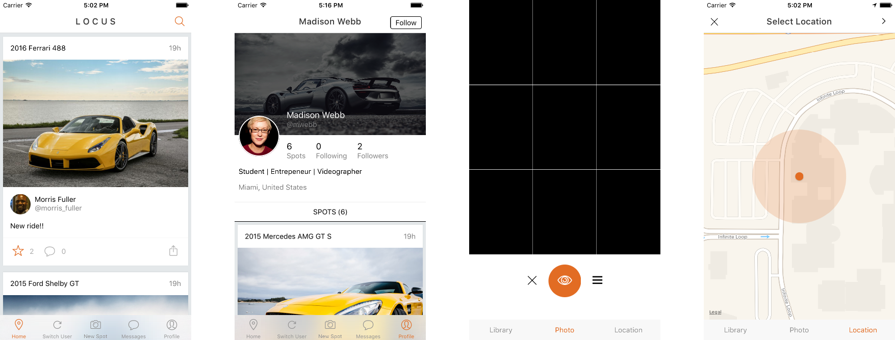

# Criterion B: Solution Overview

## Design

This product needed to be separated into two. The *backend* deals with running the server, and accessing a database through a RESTful API. The *frontend* is the app that runs on the mobile device, it is what the end-user interacts with.

### Backend

#### Models

Models are a group of properties that get stored in the database.

This table represents all the properties of a `Spot` model:

| Property | Type | Description
| --- | --- | --- | ---
| `type` | `String` | Specify how to display this Spot. One of `photo`, `video`, `mixed` or `location`.
| `title` | `String` | Title of the Spot.
| `caption` | `String` | Description of the Spot.
| `photo` | `Photo.id` | Reference to a Photo record.
| `url` | `String` | Web URL of Spot that can be used to share on external services.
| `car` | `Car.id` | Reference to a `Car` record.
| `spotter` | `User.id` | Reference to a `User` record. This usually gets populated on requests.
| `created` | `Date` | When the record was created.
| `viewsCount` | `Number`| How many times the Spot has been viewed by a unique user.
| `likesCount` | `Number`| Amount of times the spot has been liked.
| `modified` | `Date` | When the record was last updated.
| `likes` | `Likes.id` | Reference to a `Likes` record.
| `location` | `Object` | Location object, contains latitude, longitude, altitude, city and country.

Each model can develop relationships by including references to other models, this can been seen above with the `photo`, `car`, `spotter`, and `likes` properties.

As an example, the `User` model represents a mix of both compositional and aggregational relationships.

The above diagram can be described as:

- A `User` does not depend on a parent association. Each can exist with 0 to an infinite amount of `Spot` references.
- A `Spot` cannot exist without a reference to a parent `User`. Each can have 0 to an infinite amount of `Comment` references.
- A `Comment` cannot exist without a reference to a parent `Spot`. Each can have 0 to an infinite amount of `Reply` references.
- A `Reply` does not depend on a `Comment` parent association, but does depend on a parent `Spot`. There are no child associations.

Many models within the product share similar relationships.

#### RESTful API Routes

In order to modify a record within a database, the frontend needs to send a specific HTTP request to the backend server. The request will differ depending on each action you want to perform and to which record you want to perform it on.
Every request sent to the server is accompanied with some sort of response; this might be an object with data or simply a response code.

Each request is sent via an HTTP verb of POST, GET, PUT or DELETE.

| Route | POST | GET | PUT | DELETE |
|------------------------|---------------------------|----------------------------------------------------------|-------------------------|-------------------------|
| `/spots` | Create a new Spot record. | List all Spot records. | - | - |
| `/spots/123` | - | Show the Spot record with an `id` of `123`. | Update the Spot record. | Delete the Spot record. |
| `/users` | Create a new User record | List all User records. | - | - |
| `/users/789` | - | Show the User record with an `id` of `789`. | Update the User record. | Delete the User record. |
| `/users/789/followers` | - | List all Users following the User with an `id` of `789`. | Add a new follower. | Remove a follower. |
| ... | ... | ... | ... | ... |

### Frontend

#### User Interface

The interface of this application needed to be very simple with very limited distractions.
It's a content-heavy app, so elements like images and text should be front and center;
the user should be able to interact with them with as much ease as possible.

## Testing

| Action | Method of testing | Result |
|-----------------------------------------------------------------|-------------------------------------------------------------------------------------------------------------------------|---------------------------------------------------------------------------------------------------------------------------------------------------------------------------------------|
| Records needed to be persisted to a database via a RESTful API. | Manually sent requests to all routes, waited for responses then queried the database to make sure all changes matched. | All routes modify database records successfully. All requests send back success responses. |
| Images should upload from a device onto a remote server. | Selected several images from my device's library and sent an upload request to the server. | Images uploaded successfully; they were visible within the uploads directory on the server. |
| Images need to be resized where appropriate in the user interface. | Created a series of images with very large, as well as small dimensions then made note of how they rendered in the app. | Any small images get scaled up to fit the screen of the device. Large images get scaled down. The aspect ratios were not being maintained, so additionally changes needed to be made. |
| User interface should be intuitive and easy to use. | Gathered group of users varying in age. Asked them to perform tasks within the app and made notes. | Users, both young and old where able to successfully complete all tasks. They provided positive feedback. |

## Record of tasks

| Planned Action | Details | Time (hours) | Date | Criterion |
|------------------------------------------------------------------------|-------------------------------------------------------------------------------------------------------------------------------------------------------------------------------------------------------------------------------------------------------------------------|--------------|-------------------------|-----------|
| Kick-off client/advisor consultation | Discussed overall goals of the product with the client and what features they wanted included. | 1.00 | 06/01/2016 | A |
| Research open-source technology | Found details and made notes of what open-source software I could use to develop this app. Adjusted expectations where appropriate. | 2.00 | 07/01/2016 | A |
| Client proposal | Shared research with client in the form of a proposal, received additional feedback that needed to be considered. | 1.00 | 08/01/2016 | A |
| Setup app directory structure | Installed React Native and other dependencies. Created boilerplate structure with directories for views and components. | 1.00 | 08/01/2016 | B, C |
| Create initial views and components | Implemented the built-in TabBarIOS component and some open-source components. Started creating and styling various views needed in the app. | 16.00 | 09/01/2016 - 12/01/2016 | C |
| Implement static type checking, write docs. | Installed Flow, researched, then implemented into the app. Started writing documentation from ideas and concepts. | 9.00 | 21/01/2016 - 29/01/2016 | C |
| Refactor components | Removed and cleaned up some components. Created List component wrapper for React Native's built-in ListView, then implemented into Feed. | 3.00 | 02/02/2016 - 04/02/2016 | C |
| Create backend | Performed research on technology needed. Decided on Mongoose and Express. Created first few models and route classes. | 9.50 | 06/02/2016 - 09/02/2016 | C |
| Establish model relations, implement navigation stack | New models were created, relationships were mapped out and established in the backend. Implemented React Native's Navigator stack, passing push and pop methods from top then downwards to components. | 18.00 | 11/02/2016 - 17/02/2016 | B, C |
| Further model relations, allow image uploads from camera and library. | Implemented ability to increment/decrement count properties as new records are created/deleted. Created upload route that saves images into specific directory. Added built-in CameraRoll and open-source Camera module into frontend. | 7.00 | 18/02/2016 - 22/02/2016 | C |
| Fix bugs found with some route responses. Allow user to like Spots. | Modified all update responses to a 200 OK code, instead of a useless object. Implemented ability for users to like Spots in the frontend and backend. Added static methods to get lists of likes and followers. | 6.00 | 24/02/2016 - 29/02/2016 | C |
| Allow app to switch active users. Update sorting of Spots. | AsyncStorage module has been implemented, with UserToggle view,  to allow switching between multiple users. Used Mongoose sort method to display Spot records in reverse chronological order. | 4.00 | 01/03/2016 - 04/03/2016 | C |
| Draw grid over camera. Persist photo records to database. | Used ART module to draw rule-of-thirds grid over the camera view. Photos now get persisted to database with associations to the image file and a Spot record. | 6.00 | 05/03/2016 - 09/03/2016 | C |
| Allow manual library selection. Send all data through single property. | Give users the option to select an image from the library, instead of automatically picking the newest one. Lots of issues introduced with constantly re-rendering large assets. Also, modify all components to send response data downwards through a single property. | 12.00 | 10/03/2016 - 15/03/2016 | C |
| Allow User to share location with map view. | Experimented with the built-in MapView component, as well as several open-source ones. Made conclusion after knowing user should be able to manually move the location marker. Location data also gets saved with the Spot record, instead of Photo. | 11.00 | 16/03/2016 - 20/03/2016 | C |
| Final client preview and bug fixes | Noticed last minute bug with caching large images. Fixed it and presented to client. Received good feedback to consider. | 2.5 | 21/03/2016 | C, E |